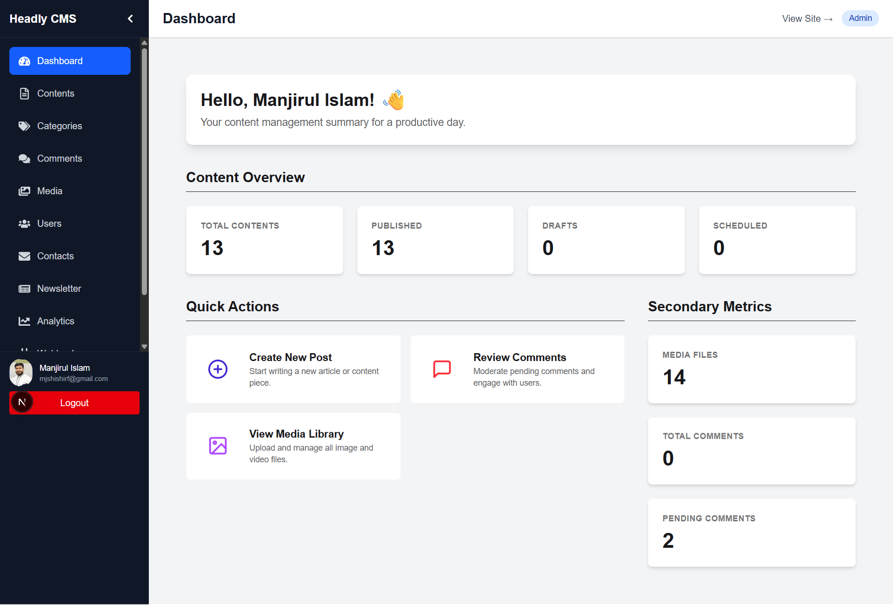
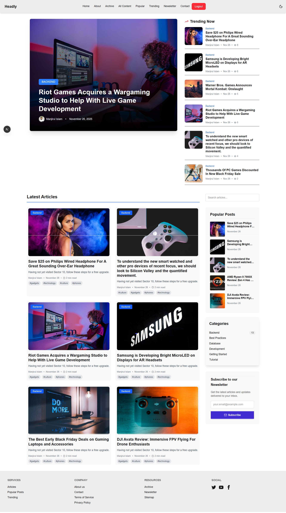

# 🎯 Headly - Full-Stack Headless CMS

<div align="center">


**A production-ready, scalable, and developer-friendly Headless CMS built with a powerful MERN stack backend and a modern Next.js frontend.** 

It includes advanced features like role-based access control, a rich content editor, media management, content scheduling, and webhook integrations.

[Live Demo](#) | [Backend Docs](#-api-documentation) | [Report Bug](https://github.com/Shishir269646/headly/issues)

</div>

---

## 📸 Screenshots

*A collection of screenshots showcasing various aspects of Headly's interface.*

| Dashboard Overview | Content Management |
| :---: | :---: |
|  *Main Dashboard Interface* |  *All Content Listing* |

| Content Editor | Media Library |
| :---: | :---: |
|  *Dashboard Content Editor* |  *Media Library for Uploads and Management* |

| Comments Management | User Profile |
| :---: | :---: |
|  *Managing User Comments* |  *User Profile and Settings* |

| Webhooks Configuration | Public Homepage (Light) |
| :---: | :---: |
|  *Webhook Management* |  *Public Homepage (Light Theme)* |

| Public Homepage (Dark) | Popular Content |
| :---: | :---: |
|  *Public Homepage (Dark Theme)* |  *Display of Popular Content* |

| Sitemap | Content Detail Page |
| :---: | :---: |
|  *Generated Sitemap* |  *Individual Content Detail Page* |

---

## ✨ Key Features

This project is a monorepo containing two main packages: `backend` and `frontend`.

### ጀ Backend (Node.js / Express)
- **🔐 Authentication & Authorization:** JWT-based auth, RBAC (Admin, Editor, Author), secure password hashing.
- **📝 Advanced Content Management:** Full CRUD, content scheduling, draft/published states, SEO-friendly slug generation.
- **🖼️ Cloud Media Management:** Cloudinary integration for image and file uploads.
- **🔗 Webhook & Integration:** Trigger frontend re-builds (Next.js ISR) automatically on content updates. Includes a retry mechanism and logging.
- **⚡ Performance & Reliability:** Background job processing, rate limiting, request validation, and comprehensive error handling.
- **🏗️ Solid Architecture:** MVC structure, service layer for business logic, middleware pipeline, and environment-based configuration.

### ✨ Frontend (Next.js / React)
- **⚛️ Modern UI with Next.js:** Built with the App Router, providing server-side rendering (SSR), and static site generation (SSG) for performance.
- **✍️ Rich Text Editor:** A Tiptap-based WYSIWYG editor for a seamless content creation experience.
- **🎛️ Feature-Rich Dashboard:** Manage content, media, users, and view analytics in a user-friendly interface.
- **💅 Styled with Tailwind CSS:** A utility-first CSS framework for rapid UI development, enhanced with DaisyUI components.
- **🌐 Global State Management:** Redux Toolkit for predictable and centralized state control.
- **🌓 Dark/Light Mode:** Theme support for user preference.
- **📈 Data Visualization:** Charts for analytics using Recharts.

---

## 🚀 Tech Stack

| Category | Backend | Frontend |
| :--- | :--- | :--- |
| **Framework** | Express.js | Next.js, React |
| **Language** | JavaScript (ES6+) | JavaScript (ES6+), JSX |
| **Database** | MongoDB (with Mongoose) | - |
| **Styling** | - | Tailwind CSS, DaisyUI |
| **State Management**| - | Redux Toolkit |
| **Form Handling** | - | React Hook Form |
| **Text Editor** | - | Tiptap |
| **API Client** | Axios | Axios |
| **Authentication**| JWT (jsonwebtoken), bcryptjs | - |
| **File Storage** | Cloudinary | - |
| **Job Queue** | Bull, Redis | - |
| **Validation** | Joi | - |
| **Security** | Helmet, CORS, express-rate-limit | DOMPurify (XSS) |
| **Dev Tools** | Nodemon, ESLint, Prettier | Turbopack, ESLint |

---

## 📦 Installation & Setup

### Prerequisites
- Node.js 18.x or higher
- MongoDB 6.x or higher
- Redis (for background jobs)
- A Cloudinary account

### Step-by-Step Guide

1.  **Clone the repository:**
    ```bash
    git clone https://github.com/Shishir269646/headly.git
    cd headly
    ```

2.  **Install Dependencies for both frontend and backend:**
    ```bash
    # From the root directory
    cd backend && npm install && cd ..
    cd frontend && npm install && cd ..
    ```

3.  **Configure Backend Environment:**
    In the `backend` directory, create a `.env` file from the example:
    ```bash
    cp backend/.env.example backend/.env
    ```
    Now, edit `backend/.env` with your credentials (database URI, JWT secrets, Cloudinary keys, etc.).

4.  **Configure Frontend Environment:**
    In the `frontend` directory, create a `.env.local` file. You only need to specify the backend API URL:
    ```
    # frontend/.env.local
    NEXT_PUBLIC_API_URL=http://localhost:4000/api
    ```

5.  **Seed the Database (Optional but Recommended):**
    To create an initial admin user and sample data:
    ```bash
    cd backend && npm run seed:admin
    ```

6.  **Run the Development Servers:**
    Open two separate terminals:
    ```bash
    # In terminal 1: Start the backend server
    cd backend
    npm run dev
    ```
    ```bash
    # In terminal 2: Start the frontend server
    cd frontend
    npm run dev
    ```

The backend API will be running at `http://localhost:4000/api` and the frontend application at `http://localhost:3000`.

---

## 📁 Project Structure

The project is a monorepo with a `backend` and a `frontend` directory, keeping concerns clearly separated.

```
headly/
├── backend/          # Node.js/Express.js API (The Headless Part)
│   ├── config/       # Database, Passport, Cloudinary config
│   ├── controllers/  # API route handlers
│   ├── jobs/         # Background job definitions (Bull)
│   ├── middlewares/  # Express middlewares (auth, RBAC, error handling)
│   ├── models/       # Mongoose schemas
│   ├── routes/       # API route definitions
│   ├── services/     # Core business logic
│   ├── validators/   # Joi validation schemas
│   ├── app.js        # Main Express app setup
│   └── index.js      # Server entry point
│
├── frontend/         # Next.js/React Dashboard & Public Interface
│   ├── public/       # Static assets
│   ├── src/
│   │   ├── app/      # Next.js App Router
│   │   │   ├── (auth)/      # Login, register pages
│   │   │   ├── (dashboard)/ # Protected admin/editor routes
│   │   │   ├── (public)/    # Public-facing pages (homepage, etc.)
│   │   │   └── api/         # Next.js API routes (e.g., revalidate)
│   │   ├── components/  # Reusable React components (UI, editor, etc.)
│   │   ├── hooks/       # Custom React hooks (useAuth, useContent)
│   │   ├── libs/        # Axios instance, utils
│   │   └── store/       # Redux Toolkit store, slices, and provider
│   ├── tailwind.config.mjs # Tailwind CSS configuration
│   └── next.config.mjs     # Next.js configuration
│
├── .gitignore
└── README.md
```

---

## 📚 API Documentation

The backend provides a RESTful API to manage all aspects of the CMS.

**Base URL:** `http://localhost:4000/api`

### Key Endpoints

| Method | Endpoint | Description | Auth Required |
| :--- | :--- | :--- | :---: |
| **Auth** | | | |
| POST | `/auth/login` | User login to get JWT tokens. | ❌ |
| POST | `/auth/register` | Register a new user. | ❌ |
| GET | `/auth/me` | Get the currently logged-in user. | ✅ |
| **Content** | | | |
| GET | `/contents` | Get a paginated list of content. | ✅ |
| POST | `/contents` | Create new content. | ✅ (Author+) |
| PUT | `/contents/:id`| Update existing content. | ✅ (Author+) |
| DELETE | `/contents/:id`| Delete content. | ✅ (Editor+) |
| **Media** | | | |
| POST | `/media/upload`| Upload a single file. | ✅ (Author+) |
| DELETE | `/media/:id` | Delete a media file. | ✅ (Editor+) |

*For a full list of API endpoints and their details, please refer to the backend route definitions in `backend/routes/`.*

---

## 🐳 Docker

The backend is container-ready.

```bash
# Navigate to the backend directory
cd backend

# Build the Docker image
docker build -t headly-backend .

# Run with Docker Compose (ensure you have a docker-compose.yml file)
docker-compose up -d
```
---

## 🤝 Contributing

Contributions are what make the open-source community such an amazing place to learn, inspire, and create. Any contributions you make are **greatly appreciated**.

1.  Fork the Project
2.  Create your Feature Branch (`git checkout -b feature/AmazingFeature`)
3.  Commit your Changes (`git commit -m 'Add some AmazingFeature'`)
4.  Push to the Branch (`git push origin feature/AmazingFeature`)
5.  Open a Pull Request

---

## 📄 License

Distributed under the MIT License. See `LICENSE` for more information.

---

## 👨‍💻 Author

**Manjirul Islam Shishir**

-   GitHub: [@Shishir269646](https://github.com/Shishir269646)
-   Portfolio: [manjirulshishir.com](https://manjirulshishir.com/)
-   LinkedIn: [/in/manjirulislamshishir/](https://www.linkedin.com/in/manjirulislamshishir/)

---

<div align="center">

**⭐ Star this repository if you find it helpful! ⭐**

</div>